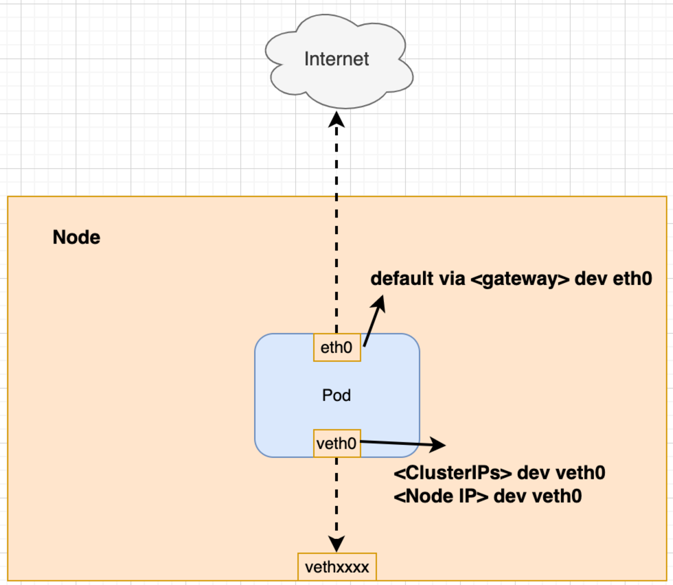
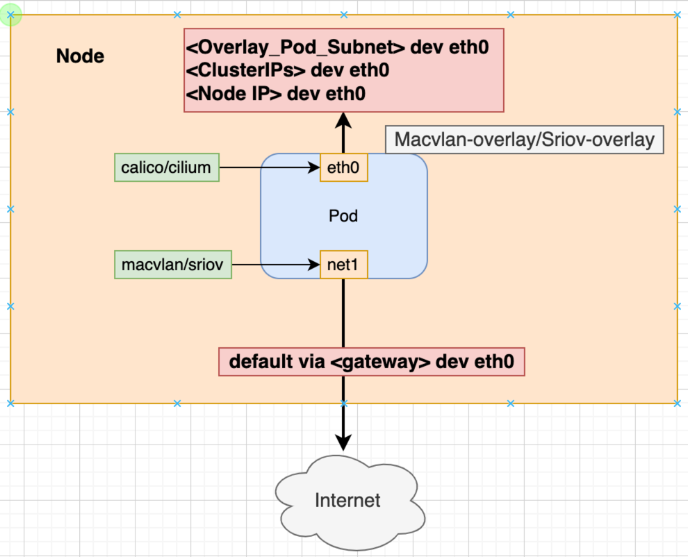

# Design Document

## Veth Plugin

### Motivation

As we know, Typically, in Kubernetes each pod only has one network interface (apart from a loopback), This NIC is usually assigned by cni such as calico, cilium, etc. We call them overlay-cni.
If the first NIC of a pod is created by macvlan, Because of the macvlan mechanism, this may have the following two problems:

- Pod cannot communicate with the host where the pod in.
- Pod cannot communicate with Kubernetes Services.

So `veth` plugin can help us to solve with these problems.

### Solution

The core idea is to create a pair of veth, The one pair is placed to the host (with veth as the prefix name), The another one is placed in the net namespace of the pod (called veth0), 
and the traffic between the pod and the host, and between the pod and the service is forwarded via the veth device.

Here is a schematic of workflow:

```


┌───────────────┐    ┌───────────────┐    ┌──────────────────────┐     ┌──────────────────┐    ┌──────────────────────────┐
│               │    │               │    │                      │     │                  │    │                          │
│   cmdAdd      ├──>─┤   SetupVeth   ├─>──┤   setupNeighborhood  ├──>──│    setupRoutes   │──>─│   MigrateRoute(optional) │ -> End
│               │    │               │    │                      │     │                  │    │                          │
└───────────────┘    └───────────────┘    └──────────────────────┘     └──────────────────┘    └──────────────────────────┘
                                    

```

- `SetupVeth`: Create a pair of veth, put on containers and hosts.
- `setupNeighborhood`: Create neighborhood table, to solve with pod cannot communication with host. Equal to: `ip n add <PodIP> dev <host_veth> lladdr <pod_veth_mac> nud permanent` on host and `ip n add <hostIP> dev <pod_veth> lladdr <host_veth_mac> nud permanent`
- `setupRoutes`: According to the configured the subnet of pod and service, add a route to the pod like this: `ip route add <pod_subnet> dev veth0` and `ip route add <service_subnet> dev veth0`.
- `MigrateRoute`: Specific for more than one macvlan NIC, We move all routes from the second NIC to table 200(by default), Keep the route of the first NIC in the main table. Of course, you can also configure the CNI to decide whether to dive or not, the default is yes.

In addition, `veth` also sets some sysctl parameters, including setting `disable_ipv6` and `rp_filter`.

When the cni call finishes, you will see there are only one NIC inside pod, Which is created by `macvlan or sriov`, and device `veth0` is created by `veth` plugin, As shown the following:



Here are the CNI configuration notes:

- `overlay_hijack_subnet`: The subnet of default overlya-cni(such calico or cilium), Including IPv4 and IPv6(optional).Input format like: 10.244.0.0/18.
- `service_hijack_subnet`: The subnet of Service clusterIP, Including IPv4 and IPv6 (optional), input format like: 10.244.0.0/18. 
- `additional_hijack_subnet`: additional customizable routes, Pod will forward this traffic through the veth device. input format like: 10.244.0.0/18.
- `migrate_route`: List of available values: `-1,0,1`, Default value is `-1`. This indicates whether to move the route for that added NIC to the new table. `-1` means migrate according to NIC name order(eth0 < net1 < net2), `0` means don't migration, `1` means migrate. 
- `skip_call`: Indicates whether to skip the call of this plugin, default is false.
- `log_options`: Log configuration. By default, the log level is `Debug`, and the log_file path is `/var/log/meta-plugins/veth.log`.
- `rp_filter`: Set the `rp_filter` parameter of the host, List of available value: `0,1,2`. Default value is `2`.

## Router Plugin

### Motivation

In some user cases, First NIC is assigned by default overlay-cni(calico or cilium), Users hopes second NIC are assigned by `macvlan` or `sriov` etc. `Router` plugin makes first NIC forwards east-west traffic of the cluster, second NIC forwards east-west traffic of the cluster.

### How to work

The router plugin controls the forwarding of packets from different NICs through policy route. In general, east-west traffic is forwarded from eth0 and north-south traffic is forwarded from eth1. The `Router` plugin moves all routes from the `eth0` in the pod to table 200(By default) and keeps the routes from the new NIC(eth1) in the main table. 

When the cni call finishes, you will see there are two NICs inside pod, First one is created by `calico or cilium`, and second one is created by `macvlan or sriov`, As shown the following:



Here is a schematic of workflow:

```


┌───────────────┐    ┌───────────────────────┐    ┌──────────────────────┐     ┌─────────────────────────┐    ┌──────────────────────────┐
│               │    │                       │    │                      │     │                         │    │                          │
│   cmdAdd      ├──>─┤   addChainedIPRoute   ├─>──┤   addHostIPRoute     ├──>──│    HijackCustomSubnet   │──>─│   MigrateRoute(optional) │ --> 
│               │    │                       │    │                      │     │                         │    │                          │
└───────────────┘    └───────────────────────┘    └──────────────────────┘     └─────────────────────────┘    └──────────────────────────┘

┌────────────────────┐   
│                    │   
│  MigrateRoute      ├──-> End
│                    │ 
└────────────────────┘ 


```

- `addChainedIPRoute`: Create some routes for the routes of pod second NICs on the host. Equal to: `ip route add <Pod_IPS> dev eth0` on the host.
- `addHostIPRoute`: Create some routes for the routes of hostIPs on the pod. Equal to: `ip route add <Host_ips> dev cali*` on the pod.
- `setupRoutes`: According to the configured the subnet of pod and service, add a route to the pod like this: `ip route add <pod_subnet> dev veth0` and `ip route add <service_subnet> dev veth0`.
- `MigrateRoute`: Specific for more than one macvlan NIC, We move all routes from the second NIC to table 200(by default), Keep the route of the first NIC in the main table. Of course, you can also configure the CNI to decide whether to dive or not, the default is yes.

In addition, `router` also sets some sysctl parameters, including setting `disable_ipv6` and `rp_filter`.

Here are the CNI configuration notes:

- `overlay_hijack_subnet`: The subnet of default overlya-cni(such calico or cilium), Including IPv4 and IPv6(optional).Input format like: 10.244.0.0/18.
- `service_hijack_subnet`: The subnet of Service clusterIP, Including IPv4 and IPv6 (optional), input format like: 10.244.0.0/18.
- `additional_hijack_subnet`: additional customizable routes, Pod will forward this traffic through the veth device. input format like: 10.244.0.0/18.
- `migrate_route`: List of available values: `-1,0,1`, Default value is `-1`. This indicates whether to move the route for that added NIC to the new table. `-1` means migrate according to NIC name order(eth0 < net1 < net2), `0` means don't migration, `1` means migrate.
- `skip_call`: Indicates whether to skip the call of this plugin, default is false.
- `log_options`: Log configuration. By default, the log level is `Debug`, and the log_file path is `/var/log/meta-plugins/veth.log`.
- `rp_filter`: Set the `rp_filter` parameter of the host, List of available value: `0,1,2`. Default value is `2`.
- `overlay_interface`: Default is `eth0`, Indicates the default overlay NIC name, The `router` plugin will follow the NIC name to determine whether to migrate the route to another route rule table.
